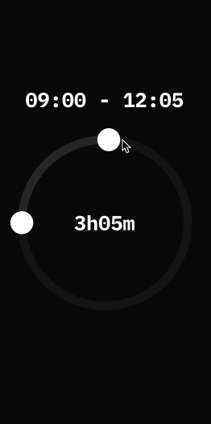

# react-native-circular-slider

React Native component for creating circular slider. This is a simplified version of [bartgryszko/react-native-circular-slider](https://github.com/bartgryszko/react-native-circular-slider), with added support for handling touch events on slider.



## Modifications made in this fork

* Add support for handling touch events on slider, not just on start and end handler
* Remove dependencies `d3-interpolate` and `lodash.range` since this variant does not need support for gradient slider
* Remove unused code such as ClockFace
* Use StandardJS

## Installation

1. Install library and react-native-svg

	```
	npm install EarthPeople/react-native-circular-slider#v2.0.5 react-native-svg
	```
2. Link native code for SVG

	```
	react-native link react-native-svg
	```

## Usage

Import Circular Slider

```js
import CircularSlider from 'react-native-circular-slider'
```

Use as follows:

```jsx
<CircularSlider
  startAngle={this.state.startAngle}
  angleLength={this.state.angleLength}
  onUpdate={({ startAngle, angleLength }) => this.setState({ startAngle, angleLength })}
  strokeWidth={40}
  radius={145}
  fillColor='#2a2a2b'
  backgroundFillColor='#151516'
  stopIcon={<G><Path .../></G>}
  startIcon={<G><Path .../></G>}
/>
```


## Configuration

You can configure the passing by following props:

- **startAngle** – angle where the slider starts (from 0 to 2π)
- **angleLength** - length of the slider (from 0 to 2π)
- **onUpdate({ startAngle, angleLength })** - when slider is moved, onUpdate(data) is triggered, where data is an object of new values of startAngle and angleLength.
- **strokeWidth** - width of slider
- **radius** - size of the slider
- **fillColor** - slider color
- **backgroundFillColor** - color of the circle under the slider (pathway for a slider)
- **stopIcon** - SVG Path for a stop icon (see the example)
- **startIcon** - SVG Path for a start icon (see the example)

## Author

Bartosz Gryszko (b@gryszko.com). For new components and updates [follow Bartosz Gryszko on Twitter](https://twitter.com/bartgryszko).

## License

MIT
